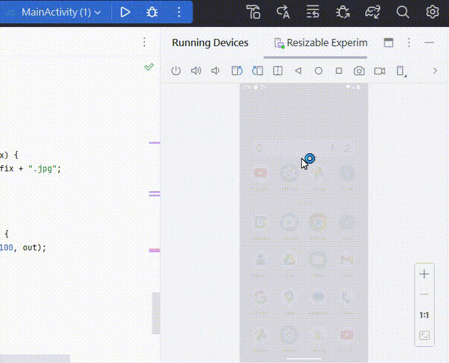

# 開發一個OpenCV應用程式：從照片到灰階

開發一個可以讀取手機照片並將其轉換為灰階的應用程式

在這篇文章中，我將帶你走過開發的每個步驟，從設置Android Studio專案到處理圖像並儲存它們。

你可能需要先了
1. [解如何設置opencv的環境](https://github.com/orange1314/android-studio-OpenCV)
2. [如何讓照片變成灰階](https://github.com/orange1314/-Android-Studio-OpenCV-Grayscale-Processing-)
3. [如何讀取手機相簿](https://github.com/orange1314/android-studio-read-photos)

接下來才開始讓我們從手機相本當中選擇照片轉換灰階!

## activity_main.xml

<!-- activity_main.xml -->
<RelativeLayout xmlns:android="http://schemas.android.com/apk/res/android"
    xmlns:tools="http://schemas.android.com/tools"
    android:layout_width="match_parent"
    android:layout_height="match_parent"
    tools:context="com.example.opencv.MainActivity">

    <ImageView
        android:id="@+id/imageViewOriginal"
        android:layout_width="match_parent"
        android:layout_height="match_parent"
        android:contentDescription="original_image_description"
        android:scaleType="centerCrop" />

    <ImageView
        android:id="@+id/imageViewProcessed"
        android:layout_width="match_parent"
        android:layout_height="match_parent"
        android:scaleType="centerCrop"
        android:visibility="gone"
        android:contentDescription="processed_image_description"
        />

    <Button
        android:id="@+id/btnProcess"
        android:layout_width="wrap_content"
        android:layout_height="wrap_content"
        android:layout_alignParentBottom="true"
        android:layout_centerHorizontal="true"
        android:layout_marginBottom="50dp"
        android:text="Process Image" />

    <Button
        android:id="@+id/btnOpenGallery"
        android:layout_width="wrap_content"
        android:layout_height="wrap_content"
        android:layout_alignParentBottom="true"
        android:layout_centerHorizontal="true"
        android:layout_gravity="center"
        android:text="OpenGallery" />

</RelativeLayout>


**這個佈局包含了一個 RelativeLayout，其中包含了兩個 ImageView（用於顯示原始圖像和處理後的圖像）和兩個 Button（用於處理圖像和開啟相簿）。以下是各個元素的解釋：**

**ImageView 元素：**
- `imageViewOriginal`：顯示原始圖像的 ImageView，使用 `centerCrop` 屬性使圖像居中裁剪。
- `imageViewProcessed`：顯示處理後圖像的 ImageView，使用 `centerCrop` 屬性使圖像居中裁剪，`visibility` 被設為 `gone`，表示一開始它是隱藏的。

**Button 元素：**
- `btnProcess`：用於處理圖像的按鈕，設有相應的寬度、高度、底部對齊、水平居中和底部外邊距。
- `btnOpenGallery`：用於開啟相簿的按鈕，設有相應的寬度、高度、底部對齊、水平居中、並以居中對齊方式佈局。

**此佈局是一個相對佈局，元素的位置是相對於父佈局或其他元素的位置定義的。這個佈局的目的是提供一個簡單的用戶界面，使用戶能夠選擇圖像、處理圖像並查看處理後的結果。**


## MainActivity.java

```

// 包名
        package com.example.sementation;

// Android 相關的 imports

import android.app.Activity;
import android.content.Intent;
import android.graphics.Bitmap;
import android.os.Bundle;
import android.provider.MediaStore;
import android.util.Log;
import android.view.View;
import android.widget.Button;
import android.widget.ImageView;

import org.opencv.android.OpenCVLoader;
import org.opencv.core.Mat;
import org.opencv.imgproc.Imgproc;

import java.io.File;
import java.io.FileOutputStream;
import java.io.IOException;

// 主活動類別繼承自 Android 的 Activity 類別
public class MainActivity extends Activity {

    // 常數：用於標識從相簿中選擇照片的請求
    private static final int REQUEST_OPEN_GALLERY = 1;

    // 顯示原始和處理後圖像的 ImageView
    private ImageView imageViewOriginal, imageViewProcessed;

    // 處理圖像和開啟相簿的按鈕
    private Button btnProcess, btnOpenGallery;

    // 用於保存原始圖像的 Bitmap
    private Bitmap originalBitmap;

    // OpenCV 初始化
    static {
        if (!OpenCVLoader.initDebug()) {
            Log.e("OpenCV", "OpenCV initialization failed.");
        } else {
            Log.d("OpenCV", "OpenCV initialization succeeded.");
        }
    }

    // 活動創建時的回調方法
    @Override
    protected void onCreate(Bundle savedInstanceState) {
        super.onCreate(savedInstanceState);
        setContentView(R.layout.activity_main);

        // 初始化視圖元件
        imageViewOriginal = findViewById(R.id.imageViewOriginal);
        imageViewProcessed = findViewById(R.id.imageViewProcessed);
        btnProcess = findViewById(R.id.btnProcess);
        btnOpenGallery = findViewById(R.id.btnOpenGallery);

        // 設置按鈕點擊監聽器
        btnProcess.setOnClickListener(new View.OnClickListener() {
            @Override
            public void onClick(View view) {
                if (originalBitmap != null) {
                    // 如果是原始狀態，進行灰度處理
                    processImage(originalBitmap);
                }
            }
        });

        btnOpenGallery.setOnClickListener(new View.OnClickListener() {
            @Override
            public void onClick(View view) {
                openGallery();
            }
        });
    }

    // 打開相簿的方法
    private void openGallery() {
        Intent intent = new Intent(Intent.ACTION_PICK, MediaStore.Images.Media.EXTERNAL_CONTENT_URI);
        startActivityForResult(intent, REQUEST_OPEN_GALLERY);
    }

    // 處理返回結果的回調方法
    @Override
    protected void onActivityResult(int requestCode, int resultCode, Intent data) {
        super.onActivityResult(requestCode, resultCode, data);

        if (requestCode == REQUEST_OPEN_GALLERY && resultCode == RESULT_OK && data != null) {
            // 從相簿中選擇照片後返回
            try {
                Bitmap selectedImage = MediaStore.Images.Media.getBitmap(
                        this.getContentResolver(), data.getData());
                originalBitmap = selectedImage;
                // 顯示新選擇的照片
                imageViewOriginal.setImageBitmap(originalBitmap);
                imageViewOriginal.setVisibility(View.VISIBLE);
                imageViewProcessed.setVisibility(View.GONE);
            } catch (Exception e) {
                e.printStackTrace();
            }
        }
    }

    // 處理圖像的方法
    private void processImage(Bitmap originalBitmap) {
        // 轉換為灰度圖像
        Mat originalMat = new Mat();
        org.opencv.android.Utils.bitmapToMat(originalBitmap, originalMat);

        Mat grayMat = new Mat();
        Imgproc.cvtColor(originalMat, grayMat, Imgproc.COLOR_BGR2GRAY);

        // 創建一個處理後的灰度圖像的 Bitmap
        Bitmap processedBitmap = Bitmap.createBitmap(grayMat.cols(), grayMat.rows(), Bitmap.Config.ARGB_8888);
        org.opencv.android.Utils.matToBitmap(grayMat, processedBitmap);

        // 保存處理後的灰度圖像到相簿
        saveImageToGallery(processedBitmap, "grey");

        // 顯示處理後的灰度圖像
        Object Bitmap = null;
        imageViewProcessed.setImageBitmap(processedBitmap);
        imageViewProcessed.setVisibility(View.VISIBLE);
        imageViewOriginal.setVisibility(View.GONE);
    }

    // 保存圖像到文件的方法
    private void saveImageToGallery(Bitmap bitmap, String suffix) {
        String fileName = "your_original_file_name" + "_" + suffix + ".jpg";

        // 保存到應用的文件目錄
        File file = new File(getFilesDir(), fileName);

        try (FileOutputStream out = new FileOutputStream(file)) {
            bitmap.compress(Bitmap.CompressFormat.JPEG, 100, out);
            out.flush();
            out.close();

            // 將圖像添加到媒體庫
            MediaStore.Images.Media.insertImage(
                    getContentResolver(),
                    file.getAbsolutePath(),
                    file.getName(),
                    file.getName()
            );

            // 文件保存成功
        } catch (IOException e) {
            e.printStackTrace();
            // 處理保存失敗的情況
        }
    }
}

```


## Android OpenCV 應用程式解析

這個 Android 應用程式使用了 OpenCV 函式庫，並提供以下主要功能：

1. 開啟相簿選擇照片
2. 將選擇的照片顯示在應用程式中
3. 將原始照片轉換成灰度照片
4. 保存處理後的灰度照片

## 程式碼解析

這是一個 Android 應用程式的程式碼，使用了 OpenCV 和 Android 元件，主要功能是打開相簿選擇照片，並對所選擇的照片進行處理。下面是程式碼的主要解析：

1. **Imports:**
   ```java
   import android.app.Activity;
   import android.content.Intent;
   import android.graphics.Bitmap;
   import android.os.Bundle;
   import android.provider.MediaStore;
   import android.util.Log;
   import android.view.View;
   import android.widget.Button;
   import android.widget.ImageView;
   
   import org.opencv.android.OpenCVLoader;
   import org.opencv.core.Mat;
   import org.opencv.imgproc.Imgproc;
   
   import java.io.File;
   import java.io.FileOutputStream;
   import java.io.IOException;
   ```

   這裡是導入所需的 Android 和 OpenCV 相關的類別。

2. **Activity Class:**
   ```java
   public class MainActivity extends Activity {
   ```

   這是主活動類別，它擴展了 Android 的 `Activity` 類別。

3. **靜態區塊 (Static Block):**
   ```java
   static {
       if (!OpenCVLoader.initDebug()) {
           Log.e("OpenCV", "OpenCV initialization failed.");
       } else {
           Log.d("OpenCV", "OpenCV initialization succeeded.");
       }
   }
   ```

   這是一個靜態區塊，用於初始化 OpenCV。它檢查 OpenCV 是否成功初始化，並在 Log 中記錄結果。

4. **成員變數 (Member Variables):**
   ```java
   private static final int REQUEST_OPEN_GALLERY = 1;
   private ImageView imageViewOriginal, imageViewProcessed;
   private Button btnProcess, btnOpenGallery;
   private Bitmap originalBitmap;
   private boolean isGray = false;
   ```

   這裡定義了一些成員變數，包括相簿請求碼、兩個 `ImageView` 用於顯示原始和處理後的圖像、兩個按鈕用於處理圖像和打開相簿。

5. **onCreate 方法:**
   ```java
   @Override
   protected void onCreate(Bundle savedInstanceState) {
       super.onCreate(savedInstanceState);
       setContentView(R.layout.activity_main);
       // 初始化視圖元件
       // 設置按鈕點擊監聽器
   }
   ```

   `onCreate` 方法是活動創建時的回調方法。在這裡，它設置了活動的佈局，初始化了視圖元件，並設置了按鈕的點擊監聽器。

6. **openGallery 方法:**
   ```java
   private void openGallery() {
       Intent intent = new Intent(Intent.ACTION_PICK, MediaStore.Images.Media.EXTERNAL_CONTENT_URI);
       startActivityForResult(intent, REQUEST_OPEN_GALLERY);
   }
   ```

   這是打開相簿的方法，使用 `Intent` 來啟動相簿選擇照片的活動。

7. **onActivityResult 方法:**
   ```java
   @Override
   protected void onActivityResult(int requestCode, int resultCode, Intent data) {
       // 處理返回結果
   }
   ```

   `onActivityResult` 方法處理打開相簿活動的返回結果。如果成功選擇了照片，則將其設置為原始圖像。

8. **processImage 方法:**
   ```java
   private void processImage(Bitmap originalBitmap) {
       // 處理圖像的方法
   }
   ```

   這是處理圖像的方法，將原始圖像轉換為灰度圖像並保存。

9. **saveImageToGallery 方法:**
   ```java
   private void saveImageToGallery(Bitmap bitmap, String suffix) {
       // 保存圖像到文件的方法
   }
   ```

   這是將處理後的圖像保存到相簿的方法。

10. **完整的程式碼:**
    ```java
    // 程式碼的其餘部分，包括打開相簿的按鈕點擊監聽器和其他方法的實

現。
    ```

   完整的程式碼包括處理按鈕點擊事件、處理圖像的邏輯以及保存圖像的方法。這個程式碼基於 Android 平台，使用了 OpenCV 函式庫來處理圖像。

## AndroidManifest.xml

```
<?xml version="1.0" encoding="utf-8"?>
<manifest xmlns:android="http://schemas.android.com/apk/res/android"
    xmlns:tools="http://schemas.android.com/tools">
    <uses-permission android:name="android.permission.WRITE_EXTERNAL_STORAGE" />
    <uses-permission android:name="android.permission.READ_EXTERNAL_STORAGE" />

    <application
        android:allowBackup="true"
        android:dataExtractionRules="@xml/data_extraction_rules"
        android:fullBackupContent="@xml/backup_rules"
        android:icon="@mipmap/ic_launcher"
        android:label="@string/app_name"
        android:roundIcon="@mipmap/ic_launcher_round"
        android:supportsRtl="true"
        android:theme="@style/Theme.ReadPhotosAndApplyOpencv"
        tools:targetApi="31">
        <activity
            android:name="com.example.opencv.MainActivity"
            android:exported="true">
            <intent-filter>
                <action android:name="android.intent.action.MAIN" />

                <category android:name="android.intent.category.LAUNCHER" />
            </intent-filter>
        </activity>
    </application>

</manifest>

```

# AndroidManifest.xml 解釋

## 權限設定
```xml
<uses-permission android:name="android.permission.WRITE_EXTERNAL_STORAGE" />
<uses-permission android:name="android.permission.READ_EXTERNAL_STORAGE" />
```
此部分聲明應用程式需要外部存儲的讀取和寫入權限。

## 應用程式配置

```
<application
    android:allowBackup="true"
    android:dataExtractionRules="@xml/data_extraction_rules"
    android:fullBackupContent="@xml/backup_rules"
    android:icon="@mipmap/ic_launcher"
    android:label="@string/app_name"
    android:roundIcon="@mipmap/ic_launcher_round"
    android:supportsRtl="true"
    android:theme="@style/Theme.ReadPhotosAndApplyOpencv"
    tools:targetApi="31">
```
- `allowBackup`：指示應用程式是否允許備份到雲端（`true` 表示允許）。
- `dataExtractionRules`：指向一個 XML 文件，該文件包含數據提取規則。
- `fullBackupContent`：指向一個 XML 文件，其中包含關於應用程式完整備份的規則。
- `icon` 和 `roundIcon`：分別設定應用程式的圖示和圓形圖示。
- `label`：應用程式的顯示名稱。
- `supportsRtl`：指示應用程式是否支持右至左的佈局。
- `theme`：應用程式的主題風格。
- `tools:targetApi`：指定此應用程式的目標 API 版本。

## 主活動設定

```
<activity
    android:name="com.example.opencv.MainActivity"
    android:exported="true">
    <intent-filter>
        <action android:name="android.intent.action.MAIN" />
        <category android:name="android.intent.category.LAUNCHER" />
    </intent-filter>
</activity>
```

- `android:name`：指定主活動的類別。
- `android:exported`：指示是否允許其他應用程式啟動這個活動（`true` 表示允許）。
- `<intent-filter>` 元素：包含了活動的意圖過濾器，其中 `MAIN` 表示這是應用程式的主活動，`LAUNCHER` 表示這是啟動器圖示。


### 成果展示




```python

```
